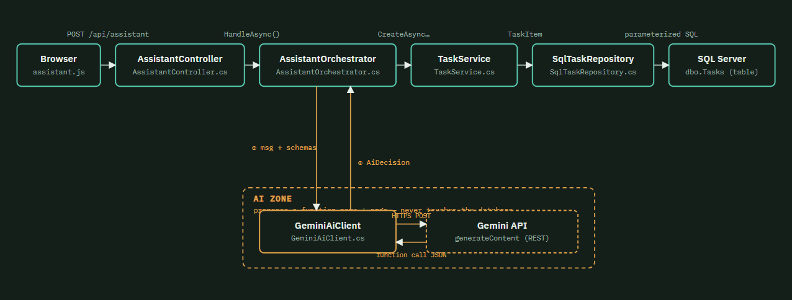
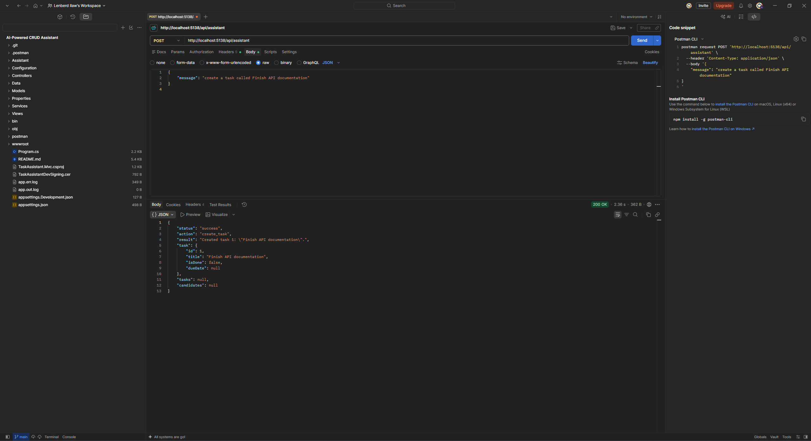
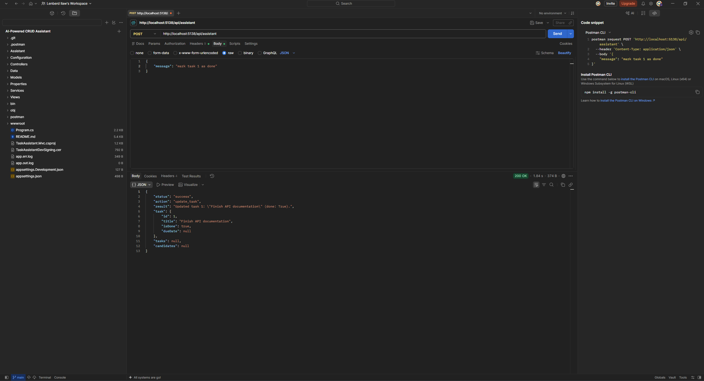
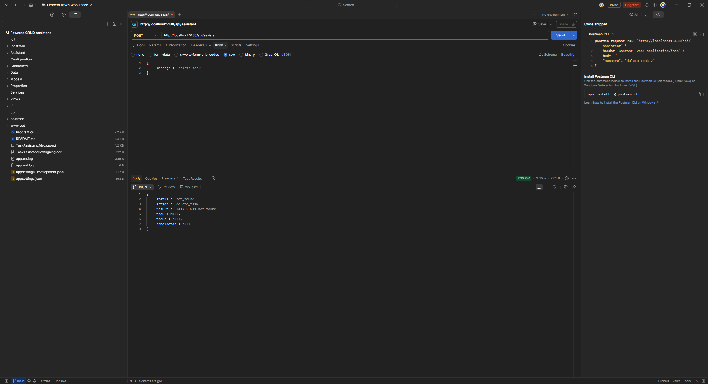

# AI-Powered CRUD Assistant — Task Manager API

ASP.NET Core 8 Web API + ADO.NET (SQL Server/LocalDB, no ORM) + Google Gemini function calling.
Users type plain English; Gemini decides which task action applies; the C# backend validates and
executes it. The AI never touches the database directly.

## How to run

1. Requires: .NET 8 SDK, SQL Server/LocalDB, a Gemini API key ([aistudio.google.com/apikey](https://aistudio.google.com/apikey)).

2. Connection string is already set in `appsettings.json` for LocalDB — the app auto-creates the
   database and `dbo.Tasks` table on startup, no manual migration needed.

3. Set your API key (don't put it in appsettings.json):

   ```bash
   cd TaskAssistant.Mvc
   dotnet user-secrets init
   dotnet user-secrets set "Gemini:ApiKey" "YOUR_KEY"
   ```

4. Run it: `dotnet run`, then open the printed URL.

## AI provider

**Google Gemini** (`gemini-3.6-flash`, model id configurable via `Gemini:Model`), called via its
REST `generateContent` endpoint with native function calling
(`toolConfig.functionCallingConfig.mode = "ANY"` forces a structured function call every time).
Chosen for the generous free tier and first-class tool calling with no SDK needed.

## Architecture



Teal is the execution spine — the only path that reaches `dbo.Tasks`. Amber is the AI branch:
`AssistantOrchestrator` hands it a message and gets back a decision, nothing more —
`GeminiAiClient` has no reference to the database layer at all.

- `Data/` — `SqlTaskRepository`: 100% ADO.NET, every query parameterized.
- `Services/` — `TaskService`: validation + title-resolution logic, used by both the plain
  REST controller and the AI orchestrator.
- `Assistant/` — `AssistantToolCatalog` (tool schemas: `create_task`, `update_task`,
  `delete_task`, `get_task`, `list_tasks`, `reject_request`), `GeminiAiClient` (talks to Gemini
  only), `AssistantOrchestrator` (the bridge that validates and executes a proposed call),
  `ConversationStore` (multi-turn context).
- `Controllers/TasksController.cs` — baseline CRUD, no AI.
- `Controllers/AssistantController.cs` — `POST /api/assistant`.

## Bonus features implemented

- **Multi-turn context** — a `conversationId` threads recent turns back into Gemini, so "actually
  make that due tomorrow" resolves without repeating the task title.
- **Delete confirmation** — `delete_task` never runs immediately; it returns
  `confirmation_required` first, and a second confirmed request (no AI round-trip) executes it.
- **Audit logging** — every AI-proposed call, accepted or rejected, is logged server-side
  (`ILogger`, including the user's own message alongside the decision or failure reason) and also
  shown live in the UI's sidebar audit log.

## Error handling (Section 5)

### 1. Off-topic message (small talk, unrelated questions)

- **What happens:** Gemini can only pick from the six catalog functions — anything unrelated to
  tasks triggers `reject_request(reason)`, returned as `{status: "rejected"}` (HTTP 200).
- **Why:** `toolConfig.functionCallingConfig.mode = "ANY"` forces a structured function call on
  every request, so there is no path where the model just answers a question directly — off-topic
  input is routed into a typed, harmless function instead of free text.

### 2. Reference to a task that doesn't exist (`"mark task 999 as done"`)

- **What happens:** `TaskService` looks the id up, finds nothing, and throws
  `TaskNotFoundException`; the orchestrator catches it and returns `{status: "not_found"}` (HTTP 200).
- **Why:** A missing row is an expected outcome, not a bug — surfacing it as structured data lets a
  caller branch on `status` instead of parsing a stack trace or getting a 500.

### 3. Ambiguous reference (two tasks contain "report", user says "delete the report task")

- **What happens:** `SqlTaskRepository.FindByTitleAsync` returns every title match; two or more
  throws `AmbiguousTaskReferenceException`, returned as `{status: "ambiguous", candidates: [...]}`
  listing every match.
- **Why:** Guessing which task the user meant risks acting on the wrong row, especially for a
  delete — returning the candidates and asking is safer than a coin flip.

### 4. AI proposes a call with missing or invalid arguments (no title for `create_task`)

- **What happens:** The backend re-validates independently of Gemini's own schema:
  `TaskService.CreateAsync` throws `TaskValidationException` on a blank title,
  `ArgReader.TryGetDate` rejects an unparseable date. Both map to `{status: "invalid_arguments"}`.
- **Why:** A schema marking a field "required" doesn't guarantee the model actually filled it in
  correctly — the backend, not the AI, is the last line of validation.

### 5. The AI API itself is unavailable or times out

- **What happens:** `GeminiAiClient` wraps a missing API key, a failed HTTP call, a non-2xx
  response, or a hard timeout as `AiUnavailableException`, with a plain-English reason per HTTP
  status code (rate limit, overloaded, bad key, etc.). `AssistantController` returns
  `{status: "error"}` at HTTP 503.
- **Why:** A third-party outage shouldn't crash the endpoint or leak a raw exception to the client —
  it becomes an explainable, retryable response instead.

### 6. Argument values shaped like SQL injection (a quote or SQL keywords in a title)

- **What happens:** Every `SqlTaskRepository` query uses `SqlParameter`
  (`command.Parameters.Add("@Title", ...).Value = task.Title`), never string concatenation.
- **Why:** Parameterization, not string-sanitizing, is what actually neutralizes this — a title
  like `Robert'); DROP TABLE Tasks;--` is sent to SQL Server as a data value, so it is simply
  stored as that literal text instead of being parsed as SQL.

Any other unexpected exception is caught in `AssistantController` and returns `{status: "error"}`
at HTTP 500 instead of crashing the process.

## Short answer questions

**1. Why shouldn't the AI have direct DB/SQL access?**
Its output is untrusted input, not trusted code. Direct SQL access means a bad or manipulated
prompt could drop tables, run unbounded deletes, or leak data. Limiting it to a fixed set of typed
functions means the worst it can do is propose the wrong call — which the backend still validates,
resolves, and (for deletes) confirms before anything happens.

**2. What's required vs. optional in `create_task`?**
Only `title` is required — a task without one isn't a task. `dueDate` and `isDone` are optional,
matching the entity's own defaults (`IsDone = false`, `DueDate = null`), and the backend
re-validates the title itself rather than trusting the AI's schema conformance.

**3. What would you add with more time?**
Auth + rate limiting on `/api/assistant` — right now anyone who can reach it can spend Gemini
quota and mutate any task with no per-user scoping. I'd also persist the audit log to a table
instead of just `ILogger`.

## Example interactions

**1. SQL injection attempt** — `{"message":"Create task Robert'); DROP TABLE Tasks;--"}` →
`{"status":"success","action":"create_task","result":"Created task 7: \"Robert'); DROP TABLE Tasks;--\"."}`
— title stored byte-for-byte, `Tasks` table untouched.

**2. Not-found error** — `{"message":"delete all"}` →
`{"status":"not_found","action":"delete_task","result":"No task matching \"all\" was found."}`

**3. Ambiguous reference** — `{"message":"Delete the report task"}` (4 tasks contain "report") →
`{"status":"ambiguous","action":"delete_task","candidates":[...4 tasks...]}`

### Screenshots (Postman, hitting `POST /api/assistant`)

**Create** — `{"message":"create a task called Finish API documentation"}` → `create_task`, task 1 created:



**Update** — `{"message":"mark task 1 as done"}` → `update_task`, task 1's `isDone` flips to `true`:



**Error case (Section 5 — reference to a task that doesn't exist)** — `{"message":"delete task 2"}` →
`status: "not_found"`, handled without crashing:



Reproduce with curl:

```bash
curl -X POST http://localhost:5299/api/assistant -H "Content-Type: application/json" \
  -d '{"message":"Mark task 999 as done"}'
```

Baseline CRUD: `curl http://localhost:5299/api/tasks`
